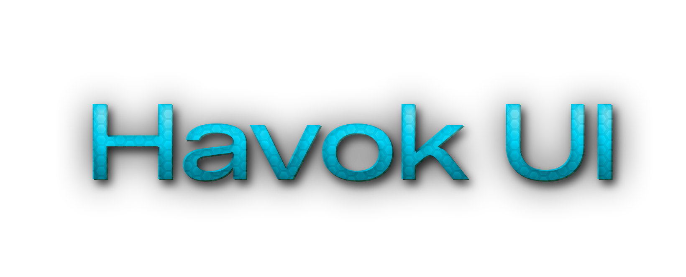

# Havok UI

A Bootstrap based CSS theme for your awesome webpages. For a demo, visit https://theonlyasdk.github.io/havok-ui

## Usage
Assuming you already imported Bootstrap CSS and JS in your page, simply download `css/havokui.css` and import it in your webpage. It's that simple.

## Why
I make a lot of websites with Bootstrap and I wasn't able to find any Bootstrap theme that I liked personally, so I said to myself: "Why not make a Bootstrap theme, wouldn't that be a fun project eh?"

# Contribution
If you find any visual bugs or would like to clean up the messy-ass code, you're always welcome to make a PR. Also you should open an issue if you find any sneaky visual bugs.

> Hope you'll enjoy using this theme! 😁
